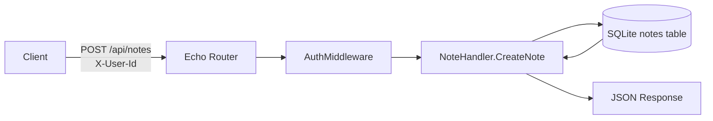
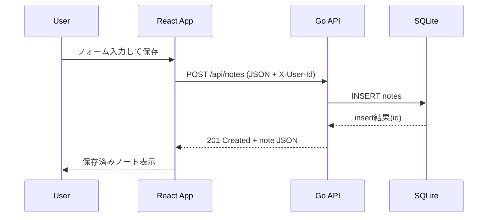

# mini-datastore

`mini-datastore` は、**フロントエンドからバックエンド、そしてSQLite保存までの流れ**を手で実装しながら理解するための学習プロジェクトです。

---

## 1. プロジェクトの目的

- React から API を呼ぶ流れを理解する
- Go (Echo) で API ハンドラを書く流れを理解する
- `internal` 配下で責務を分ける設計に慣れる
- SQLite への保存と取得の最小実装を理解する

---

## 2. 現在の構成

```text
mini-datastore/
├─ cmd/
│  └─ server/
│     └─ main.go                 # サーバー起動、ルーティング設定
├─ internal/
│  ├─ db/
│  │  └─ db.go                   # SQLite初期化、テーブル作成
│  ├─ handler/
│  │  └─ note_handler.go         # /api/notes のHTTPハンドラ
│  ├─ middleware/
│  │  └─ auth.go                 # X-User-Idヘッダの認証ミドルウェア
│  └─ model/
│     └─ note.go                 # Note構造体(JSON/DB受け渡し)
├─ data/
│  └─ app.db                     # SQLiteファイル
└─ web/
   ├─ src/
   │  ├─ main.tsx                # React起動
   │  └─ App.tsx                 # 現在はカウンターUIのみ
   └─ package.json
```

---

## 3. 現在のデータフロー（実装済み）

### 3.1 バックエンドだけで見た流れ



### 3.2 フロントエンドを含む理想の流れ（今後）



---

## 4. 現状ステータス（何ができていて、何が未完成か）

### 4.1 実装済み

- `GET /api/health`
- `POST /api/notes`
- `GET /api/notes`
- `GET /api/notes/:id`
- `X-User-Id` ヘッダによる簡易ユーザー分離
- SQLite への保存と取得

### 4.2 未完成（学習の主戦場）

- React 側から API 呼び出しがまだない（`App.tsx` はカウンターのみ）
- メモ作成フォームがない
- ノート一覧表示がない
- APIエラー時のUI表示がない
- フロントの `Note` 型定義・API層分離がない

### 4.3 バックエンドの改善候補

- `internal/db/db.go` の `db.Exec` 失敗時に元の `err` ではなく `filepath.ErrBadPattern` を返している
  - 学習上は動くが、デバッグ性が下がるため後で修正推奨

---

## 5. データ構造

### 5.1 DBスキーマ（現状）

```sql
CREATE TABLE IF NOT EXISTS notes (
  id INTEGER PRIMARY KEY AUTOINCREMENT,
  user_id TEXT NOT NULL,
  title TEXT NOT NULL,
  body TEXT NOT NULL,
  created_at DATETIME DEFAULT CURRENT_TIMESTAMP
);
```

### 5.2 Goのモデル

```go
type Note struct {
    ID        int       `json:"id"`
    UserID    string    `json:"user_id"`
    Title     string    `json:"title"`
    Body      string    `json:"body"`
    CreatedAt time.Time `json:"created_at"`
}
```

### 5.3 API I/O

#### 作成リクエスト

```json
{
  "title": "買い物メモ",
  "body": "牛乳とパンを買う"
}
```

#### 作成レスポンス（例）

```json
{
  "id": 1,
  "user_id": "user-1",
  "title": "買い物メモ",
  "body": "牛乳とパンを買う",
  "created_at": "2026-04-30T00:00:00Z"
}
```

---

## 6. まず整理：バックエンドとフロントエンドの接続状況

```text
[現在]
React UI (counter only)   Go API (/api/notes)   SQLite
        └──── 未接続 ────┘           └── 接続済み ──┘

[目標]
React Form/List  --->  Go API Handler  --->  SQLite
    ^                                      |
    └--------------- JSON -----------------┘
```

今は **Go API と DB はつながっている**、しかし **React と API はまだ未接続**、という状態です。

---

## 7. 実装ロードマップ（手で書いて理解する用）

「一気に完成」ではなく、**1ファイルずつ**進める前提です。

### Step 0: 事前確認（読むだけ）

- `cmd/server/main.go`: どのエンドポイントがあるか把握
- `internal/handler/note_handler.go`: 入出力JSONを把握
- `web/src/App.tsx`: どこから置き換えるか把握

### Step 1: フロントに Note 型を作る

- 追加ファイル: `web/src/types/note.ts`
- 作るもの:
  - `export type Note = { id: number; user_id: string; title: string; body: string; created_at: string }`
  - `export type CreateNoteRequest = { title: string; body: string }`

**狙い**: UIとAPIの契約を先に固定する。

### Step 2: API呼び出し関数を分離する

- 追加ファイル: `web/src/lib/api.ts`
- 先に作る関数:
  - `getNotes(userId: string): Promise<Note[]>`
  - `createNote(userId: string, payload: CreateNoteRequest): Promise<Note>`
- ポイント:
  - `fetch('/api/notes', { headers: { 'X-User-Id': userId } })` の形でヘッダを明示
  - `response.ok` でエラー処理

**狙い**: `App.tsx` を UI ロジックに集中させる。

### Step 3: `App.tsx` にフォーム状態を追加

- 編集ファイル: `web/src/App.tsx`
- 先に書く状態:
  - `title`, `body`, `notes`, `loading`, `error`
- 先に書く関数:
  - `handleSubmit`
  - `loadNotes`

**狙い**: 「入力 -> 送信 -> 一覧更新」を1画面で完結させる。

### Step 4: 初期表示で一覧を取得

- 編集ファイル: `web/src/App.tsx`
- 追加するフック:
  - `useEffect(() => { loadNotes() }, [])`

**狙い**: 画面表示時点でサーバーデータを取得する基本形を習得。

### Step 5: エラー表示とUX最小改善

- 編集ファイル: `web/src/App.tsx`
- 追加:
  - 失敗時に `error` を表示
  - 送信中はボタン無効化
  - 保存後フォームクリア

**狙い**: 実運用に近い最低限のUI状態管理を学ぶ。

### Step 6: 動作確認（必須）

- バックエンド起動: `go run ./cmd/server`
- フロント起動: `cd web && npm run dev`
- 検証:
  - 保存できるか
  - 再読み込み後も一覧表示されるか
  - `X-User-Id` を変えるとデータ分離されるか

---

## 8. 実装時のチェックリスト

- [ ] フロントから `X-User-Id` ヘッダを送っている
- [ ] `POST /api/notes` の body が `{title, body}` になっている
- [ ] 成功時に一覧を再取得またはローカル更新している
- [ ] 失敗時メッセージをUIで確認できる
- [ ] `npm run lint` と `go test ./...`（将来的に）を通す

---

## 9. 次の拡張案（基礎完了後）

- `PUT /api/notes/:id` と `DELETE /api/notes/:id` の追加
- 検索・ページング
- 認証（JWT / セッション）への移行
- handler と DB の間に service 層を追加

---

## 10. 学習メモ（なぜこの順番か）

- 最初に「型」を作ると、データ契約のズレで迷いにくい
- 次に「API関数」を分離すると、UIが複雑化しにくい
- 最後に `App.tsx` を組み立てると、責務が見えやすい

この順番で進めると、`React -> API -> Handler -> DB` の流れを、ブラックボックス化せずに自分の手で追えます。
