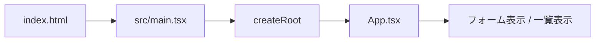
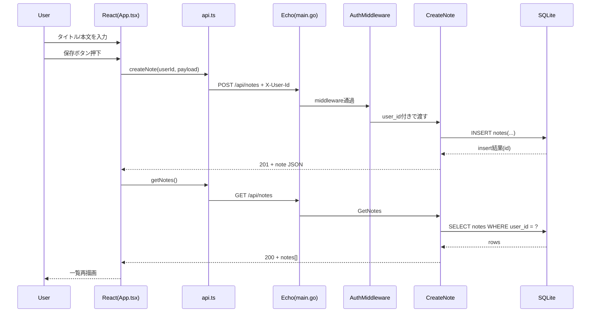
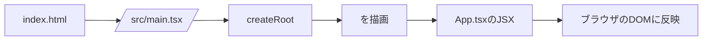
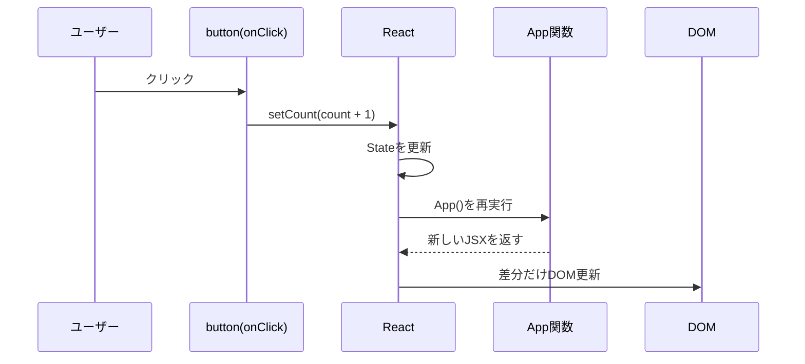

# Go + React 全体理解ガイド（mini-datastore）

このドキュメントは、`mini-datastore` を題材に、  
**ブラウザからSQLまでのデータの流れを1ファイルで理解する**ための教材です。

目標は「動いた」を超えて、次を自分の言葉で説明できることです。

- どのファイルが何の責務を持つか
- `GET / POST` がどの順番で処理されるか
- なぜ CORS / Middleware が必要か
- なぜ UI が再描画されるか

---

## 0. 最初に結論（30秒版）

```text
React(App.tsx) が fetch() で API を呼ぶ
        ↓
Go(Echo) が Middleware を通して Handler を実行
        ↓
Handler が SQLite に INSERT / SELECT
        ↓
JSONレスポンスを React が受け取って state 更新
        ↓
画面が再描画される
```

---

## 1. プロジェクト全体地図

```text
mini-datastore/
├─ cmd/server/main.go
│   └─ サーバー起動、Middleware登録、ルート登録
├─ internal/
│  ├─ middleware/auth.go
│  │   └─ X-User-Id ヘッダ検証
│  ├─ handler/note_handler.go
│  │   └─ CreateNote / GetNotes / GetNote
│  ├─ db/db.go
│  │   └─ SQLite初期化、テーブル作成
│  └─ model/note.go
│      └─ Note構造体
├─ data/app.db
│   └─ SQLiteファイル
└─ web/
   ├─ src/main.tsx
   │   └─ React起動入口
   ├─ src/App.tsx
   │   └─ 画面、state、イベント処理
   ├─ src/lib/api.ts
   │   └─ fetchラッパー（GET/POST）
   └─ src/types/note.ts
       └─ フロント側型定義
```

---

## 2. 「main.goは毎回上から実行？」問題を完全整理

### 結論

- `main()` は**サーバー起動時に1回だけ**実行される
- `e.GET(...)` / `e.POST(...)` は「その場で実行」ではなく**ルート登録**
- リクエストが来たときに、登録済みの Middleware -> Handler が実行される

### 時系列

```mermaid
flowchart TD
    A[go run ./cmd/server] --> B[main()開始]
    B --> C[DB初期化]
    C --> D[Middleware登録]
    D --> E[ルート登録 GET/POST]
    E --> F[e.Start(:8080) 待ち受け]
    F --> G[HTTPリクエスト到着]
    G --> H[CORS middleware]
    H --> I[Auth middleware]
    I --> J[Handler実行]
    J --> K[JSONレスポンス]
```

---

## 3. フロントエンド起動の流れ



ポイント:

- `main.tsx` は React アプリのブートストラップ
- 実際の画面ロジックは `App.tsx` が担当

---

## 4. データ保存フロー（POST /api/notes）

### 4-1. シーケンス図



### 4-2. この時に触る主ファイル

- `web/src/App.tsx`: `handleSubmit()`
- `web/src/lib/api.ts`: `createNote()`
- `cmd/server/main.go`: `e.POST("/api/notes", h.CreateNote)`
- `internal/handler/note_handler.go`: `CreateNote()`

---

## 5. 一覧取得フロー（GET /api/notes）

### 5-1. 初回表示時

`App.tsx` の `useEffect`（または初期ロード関数）で `getNotes()` を実行。

### 5-2. バックエンド側

1. Router が `/api/notes` を `GetNotes` へルーティング  
2. Auth が `X-User-Id` を検証  
3. `SELECT ... WHERE user_id = ?` で取得  
4. `[]Note` をJSONで返す

### 5-3. フロント側

`setNotes(data)` で state 更新し、`notes.map(...)` が再実行される。

---

## 6. CORS が必要な理由（今回ハマったポイント）

フロントとAPIの Origin が異なるためです。

- Frontend: `http://localhost:5173`
- API: `http://localhost:8080`

ブラウザはクロスオリジン時に、先に `OPTIONS` を送ります（プリフライト）。

```text
Browser -> OPTIONS /api/notes
Server  -> Access-Control-Allow-* ヘッダ付きで応答
Browser -> 実リクエスト(GET/POST)
```

CORS設定ミス時は、サーバーが生きていてもブラウザが `GET` を止めます。

---

## 7. AuthMiddleware の役割

`internal/middleware/auth.go` は「門番」です。

- `X-User-Id` がない -> `401`
- ある -> `c.Set("user_id", userID)` して次へ
- `OPTIONS` は通す（CORSプリフライト用）

この設計で「ユーザーAのメモだけ返す」を維持できます。

---

## 8. データ構造（型とDB）

### 8-1. フロント型（TypeScript）

```ts
export type Note = {
  id: number
  user_id: string
  title: string
  body: string
  created_at: string
}
```

### 8-2. バックエンド型（Go）

```go
type Note struct {
    ID        int       `json:"id"`
    UserID    string    `json:"user_id"`
    Title     string    `json:"title"`
    Body      string    `json:"body"`
    CreatedAt time.Time `json:"created_at"`
}
```

### 8-3. テーブル

```sql
CREATE TABLE IF NOT EXISTS notes (
  id INTEGER PRIMARY KEY AUTOINCREMENT,
  user_id TEXT NOT NULL,
  title TEXT NOT NULL,
  body TEXT NOT NULL,
  created_at DATETIME DEFAULT CURRENT_TIMESTAMP
);
```

---

## 9. 代表的なエラーと見方

### 9-1. CORSエラー

- ブラウザConsole: `blocked by CORS`
- Network: `OPTIONS` が失敗 / `Access-Control-Allow-Origin` 不一致
- 対応: `main.go` の CORS設定を `http://localhost:5173` に合わせる

### 9-2. 401 Unauthorized

- サーバーログ: `GET /api/notes status=401`
- 原因: `X-User-Id` ヘッダ未付与
- 対応: `api.ts` の headers を確認

### 9-3. 白画面

- Consoleを確認（runtime error）
- 例: `notes.map` で null を扱って落ちる
- 対応: APIは配列を返す、フロントで防御的に配列確認

---

## 10. いまの実装が「どこまで完了しているか」

### 完了していること

- ノート作成（POST）
- ノート一覧取得（GET）
- ノート1件取得（GET :id）
- フロントフォーム入力 -> 保存 -> 一覧再取得
- CORS + Authを含む最小実用フロー

### まだ伸ばせること

- 更新（PUT）
- 削除（DELETE）
- エラー表示の粒度改善
- API層/状態管理の分離強化

---

## 11. 理解確認クイズ（自分で答える）

1. `e.GET("/api/notes", h.GetNotes)` は何をしている？  
2. `main()` と `GetNotes()` はどちらがリクエストごとに実行される？  
3. なぜ `OPTIONS` を middleware で通す必要がある？  
4. `setNotes()` が呼ばれると、なぜ画面が更新される？  
5. `X-User-Id` はどこで検証され、どこで使われる？

---

## 12. 60秒で説明するテンプレ

「このアプリは React で入力を受けて、`api.ts` の fetch で Go API に送信します。  
Go 側は `main.go` で登録した middleware を通って `note_handler.go` が動き、SQLite に保存/取得します。  
結果は JSON で返り、React が state を更新して再描画します。  
`main()` は起動時1回、Handlerはリクエストごと、CORSは 5173 と 8080 が別Originだから必要です。」

---

## 13. 次にやると理解が深まる練習

1. `PUT /api/notes/:id` を追加して更新機能を作る  
2. `DELETE /api/notes/:id` を追加して削除機能を作る  
3. 「保存後は再取得せず、ローカル state を更新する」版に変更して比較する  
4. `service` 層を作って Handler からSQLを分離してみる

この4つをやると、実務に近い設計感が一気に身につきます。
# React超入門: この`web`フォルダがどう動いているかをゼロから理解する

この資料は、**Reactがまったく初めて**の人向けに作っています。  
「なぜ画面が変わるの？」「どこから実行されるの？」「`useState`って何？」を、今の`web`フォルダの実コードに沿って説明します。

---

## 0. まず結論: Reactは何をしている？

Reactをひとことで言うと:

- **UI(画面)を部品(コンポーネント)で作る仕組み**
- **状態(State)が変わると、必要な見た目を再計算して画面に反映する仕組み**

イメージ:

```text
状態(State)が変わる
        ↓
コンポーネント関数がもう一度実行される
        ↓
新しい見た目(JSX)が作られる
        ↓
Reactが差分を見つけてDOMを更新
```

---

## 1. この`web`フォルダの全体地図

```text
web/
├─ index.html            ← ブラウザが最初に読むHTML
├─ src/
│  ├─ main.tsx           ← Reactアプリ起動の入口
│  ├─ App.tsx            ← 画面の本体コンポーネント
│  ├─ index.css          ← 全体スタイル
│  └─ App.css            ← App用スタイル(今回はほぼ未使用)
├─ package.json          ← 使うライブラリと実行コマンド
└─ vite.config.ts        ← Viteの設定
```

実行の流れ(超重要):



---

## 2. 起動の流れを1行ずつ理解する

## 2-1. `index.html`の役割

`index.html`にはこの2つが重要です:

1. Reactが描画される空の場所  
2. 起動スクリプトの読み込み

```html
<div id="root"></div>
<script type="module" src="/src/main.tsx"></script>
```

意味:

- `<div id="root">`  
  → Reactが画面を差し込む「土台」
- `src="/src/main.tsx"`  
  → ここからReactアプリがスタート

---

## 2-2. `main.tsx`の役割(React起動)

`main.tsx`は「Reactをrootに接続して、`App`を表示する」ファイルです。

```tsx
createRoot(document.getElementById('root')!).render(
  <StrictMode>
    <App />
  </StrictMode>,
)
```

図解:

```text
document.getElementById('root')
        ↓
HTMLの<div id="root">を取得
        ↓
createRoot(その要素)
        ↓
React描画エンジンを接続
        ↓
render(<App />)
        ↓
Appコンポーネントの見た目を表示
```

`StrictMode`について(初心者向けに簡潔に):

- 開発中に「危ない書き方」を見つけやすくする安全モード
- 本番の表示そのものではなく、**開発時の品質チェック**に近い

---

## 3. `App.tsx`の原理: Stateと再描画

現在の`App.tsx`の本質はこの3行です:

```tsx
const [count, setCount] = useState(0)
<p>現在のカウント: {count}</p>
<button onClick={() => setCount(count + 1)}>カウントアップ</button>
```

---

## 3-1. `useState(0)`は何を返す？

`useState(0)`は配列を返します:

```text
[現在の値, 値を更新する関数]
```

今回は:

- `count` = 現在の値
- `setCount` = 値を更新する関数
- 初期値は`0`

---

## 3-2. ボタンを押したとき、内部で何が起きる？



ポイント:

- クリックで`setCount`が呼ばれる
- Reactは「Stateが変わった」と判断
- `App`を再実行して新しい見た目を作る
- 前回との差分だけDOMに反映する  
  (これが「効率よく更新できる」理由の1つ)

---

## 3-3. 「再描画」は何を再実行している？

初心者が混乱しやすいところです。

- Reactは**コンポーネント関数**をもう一度呼ぶ
- しかし、ブラウザのDOMを全部作り直すわけではない
- React内部で差分比較し、必要部分だけ更新する

イメージ:

```text
[1回目]
App() -> JSX(count=0) -> DOM表示

[2回目: クリック後]
App() -> JSX(count=1) -> 前回と比較 -> 数字部分だけ更新
```

---

## 4. JSXって何？(HTMLとどう違う？)

`App.tsx`のこの部分:

```tsx
return (
  <div>
    <h1>Reactの原理テスト</h1>
    <p>現在のカウント: {count}</p>
    <button onClick={() => setCount(count + 1)}>
      カウントアップ
    </button>
  </div>
)
```

これはJSXと呼ばれます。見た目はHTMLに似ていますが、実体は**JavaScript/TypeScriptの構文拡張**です。

考え方:

- HTMLっぽく書けるのでUIが読みやすい
- `{count}`のようにJavaScript値を埋め込める
- `onClick={...}`でイベント処理を直接つなげる

---

## 5. なぜ`count`を書き換えないの？(`count = count + 1`しない理由)

Reactでは「Stateは`setCount`で更新する」のがルールです。

NG例(考え方としてNG):

```tsx
count = count + 1
```

理由:

- Reactが変更を検知できない
- いつ再描画すべきかReactが判断できない

OK:

```tsx
setCount(count + 1)
```

これによりReactが更新を把握し、再描画を正しく行えます。

---

## 6. Viteは何をしている？

`package.json`のスクリプト:

- `npm run dev` → 開発サーバ起動
- `npm run build` → 本番ビルド作成
- `npm run preview` → ビルド結果をローカル確認

Viteの役割:

- 開発中の高速起動
- 変更時の即時反映(HMR)
- 本番向けに最適化した出力を生成

図:

```text
あなたがコード編集
      ↓
Viteが変更を検知
      ↓
必要な部分だけブラウザに反映
      ↓
開発体験が速い
```

---

## 7. 今のアプリを「頭の中で実行」してみる

初回表示:

1. `index.html`が読み込まれる
2. `main.tsx`が実行される
3. `App()`が実行される
4. `count = 0`で表示される

1回クリック:

1. `onClick`発火
2. `setCount(1)`呼び出し
3. Reactが再描画
4. 画面が`現在のカウント: 1`になる

もう1回クリック:

1. `setCount(2)`
2. 再描画
3. `現在のカウント: 2`

---

## 8. よくある疑問Q&A

### Q1. 関数コンポーネントって何？

**JSXを返す関数**です。  
`function App() { return (...) }`の形。

### Q2. なぜ`App`は大文字？

Reactは**大文字始まりをコンポーネント**として扱います。  
小文字だとHTMLタグ扱いになります。

### Q3. `onClick={() => ...}` の `() =>` は何？

無名関数(アロー関数)です。  
「クリックされたときに実行する処理」を渡しています。

### Q4. TypeScript(`.tsx`)で難しくならない？

最初はJavaScript感覚でOKです。  
TypeScriptは型チェックでバグを減らしてくれます。

---

## 9. 次に学ぶと一気に理解が進む順番

1. `props` (親→子へのデータ受け渡し)
2. `useEffect` (副作用: API通信など)
3. 配列の描画(`map`)
4. フォーム入力と双方向の状態管理
5. コンポーネント分割

---

## 10. 最重要ポイントだけ再確認

- Reactは**状態(State)からUIを作る**考え方
- `useState`で状態を持つ
- `setState`系関数で更新すると再描画される
- 再描画時、Reactは差分更新して効率化する
- 起動の入口は`index.html` → `main.tsx` → `App.tsx`

この流れを理解できれば、React学習の土台はできています。

---

## 11. mini-datastoreで理解する全体像（Browser -> API -> SQL -> Browser）

ここからは、実際にあなたが作った `mini-datastore` を題材に、  
「データがどう流れて戻るか」を1本線で整理します。

### 11-1. 全体マップ

```text
[Browser / React(App.tsx)]
    |
    | fetch(JSON, X-User-Id)
    v
[Go Echo Router (cmd/server/main.go)]
    |
    | Middleware (CORS -> Auth)
    v
[Handler (internal/handler/note_handler.go)]
    |
    | SQL (INSERT / SELECT)
    v
[SQLite (data/app.db)]
    |
    | query result
    v
[Handler -> JSON Response]
    |
    v
[React state更新 -> 再描画]
```

### 11-2. 保存時（入力 -> 保存）の流れ

1. ユーザーが `App.tsx` のフォームへ入力  
2. `handleSubmit` が `createNote(...)` を呼ぶ  
3. `web/src/lib/api.ts` が `POST /api/notes` を送る  
4. Echoがリクエストを受ける（`main.go` で登録済みルートへ）  
5. `AuthMiddleware` が `X-User-Id` を確認  
6. `CreateNote` がSQL `INSERT` を実行  
7. `201 Created` のJSONを返す  
8. フロントで `loadNotes()` を呼び、一覧再取得

### 11-3. 一覧取得（初回表示 / 保存後再取得）の流れ

1. `useEffect` または `loadNotes()` で `getNotes()` 実行  
2. `GET /api/notes` を送信  
3. `AuthMiddleware` が `user_id` をコンテキストへ保存  
4. `GetNotes` が `SELECT ... WHERE user_id = ?` 実行  
5. `[]Note` をJSONで返す  
6. フロントで `setNotes(data)`  
7. `notes.map(...)` で一覧描画

---

## 12. `main.go` はどう実行される？（ここが超重要）

あなたの質問の核心はここです。

### 12-1. 結論

- `main()` の中身は、**サーバー起動時に1回**実行される  
- `e.GET(...)` は「その場でAPIを実行」しているのではなく、**ルート登録**をしている  
- 実際のAPI処理（`GetNotes`, `CreateNote`）は、**リクエストが来たときに毎回**実行される

### 12-2. イメージ図

```mermaid
flowchart TD
    A[go run ./cmd/server] --> B[main()開始]
    B --> C[DB初期化]
    C --> D[Middleware登録]
    D --> E[GET/POSTルート登録]
    E --> F[e.Start(:8080) で待ち受け開始]
    F --> G[リクエスト到着]
    G --> H[CORS Middleware]
    H --> I[Auth Middleware]
    I --> J[Handler実行]
    J --> K[JSONレスポンス]
```

### 12-3. 「上から毎回実行される？」への正確な答え

半分正解、半分違います。

- 正しい部分:  
  リクエスト時は、登録されたミドルウェアとハンドラが順番に実行される
- 違う部分:  
  `main()` の先頭（DB初期化、ルート登録など）を毎回やり直すわけではない

---

## 13. じゃあCORSミドルウェアはなぜ必要？

必要です。理由は「フロントとAPIのポートが違う」からです。

- フロント: `http://localhost:5173`
- API: `http://localhost:8080`

これはブラウザ上では **別Origin** 扱いです。  
別Originへ `fetch` すると、ブラウザがまず `OPTIONS`（プリフライト）で「この通信していい？」を確認します。

サーバーが CORS ヘッダを返さないと、ブラウザが本リクエストを止めます。

### 13-1. CORSありの通信

```text
Browser -> OPTIONS /api/notes
Server  -> 204 + Access-Control-Allow-Origin など
Browser -> GET /api/notes
Server  -> 200 + JSON
```

### 13-2. CORSなし/不一致の通信

```text
Browser -> OPTIONS /api/notes
Server  -> ヘッダ不足 or Origin不一致
Browser -> GETを送らずに失敗（CORSエラー）
```

---

## 14. 最終チェック（理解確認用）

次の3つに口頭で答えられれば、かなり理解できています。

1. `e.GET("/api/notes", h.GetNotes)` は何をしている？  
   -> ルート登録（実行ではない）

2. 実際に `GetNotes` が走るのはいつ？  
   -> クライアントが `GET /api/notes` を送った時

3. CORSミドルウェアはなぜ必要？  
   -> フロント(5173)とAPI(8080)が別Originで、ブラウザが事前確認を要求するから

この3つが言えれば、今回の構成の土台はかなり強いです。
