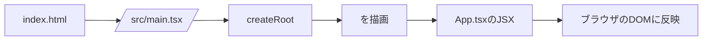
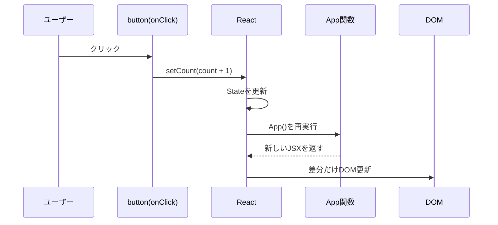

# React超入門: この`web`フォルダがどう動いているかをゼロから理解する

この資料は、**Reactがまったく初めて**の人向けに作っています。  
「なぜ画面が変わるの？」「どこから実行されるの？」「`useState`って何？」を、今の`web`フォルダの実コードに沿って説明します。

---

## 0. まず結論: Reactは何をしている？

Reactをひとことで言うと:

- **UI(画面)を部品(コンポーネント)で作る仕組み**
- **状態(State)が変わると、必要な見た目を再計算して画面に反映する仕組み**

イメージ:

```text
状態(State)が変わる
        ↓
コンポーネント関数がもう一度実行される
        ↓
新しい見た目(JSX)が作られる
        ↓
Reactが差分を見つけてDOMを更新
```

---

## 1. この`web`フォルダの全体地図

```text
web/
├─ index.html            ← ブラウザが最初に読むHTML
├─ src/
│  ├─ main.tsx           ← Reactアプリ起動の入口
│  ├─ App.tsx            ← 画面の本体コンポーネント
│  ├─ index.css          ← 全体スタイル
│  └─ App.css            ← App用スタイル(今回はほぼ未使用)
├─ package.json          ← 使うライブラリと実行コマンド
└─ vite.config.ts        ← Viteの設定
```

実行の流れ(超重要):



---

## 2. 起動の流れを1行ずつ理解する

## 2-1. `index.html`の役割

`index.html`にはこの2つが重要です:

1. Reactが描画される空の場所  
2. 起動スクリプトの読み込み

```html
<div id="root"></div>
<script type="module" src="/src/main.tsx"></script>
```

意味:

- `<div id="root">`  
  → Reactが画面を差し込む「土台」
- `src="/src/main.tsx"`  
  → ここからReactアプリがスタート

---

## 2-2. `main.tsx`の役割(React起動)

`main.tsx`は「Reactをrootに接続して、`App`を表示する」ファイルです。

```tsx
createRoot(document.getElementById('root')!).render(
  <StrictMode>
    <App />
  </StrictMode>,
)
```

図解:

```text
document.getElementById('root')
        ↓
HTMLの<div id="root">を取得
        ↓
createRoot(その要素)
        ↓
React描画エンジンを接続
        ↓
render(<App />)
        ↓
Appコンポーネントの見た目を表示
```

`StrictMode`について(初心者向けに簡潔に):

- 開発中に「危ない書き方」を見つけやすくする安全モード
- 本番の表示そのものではなく、**開発時の品質チェック**に近い

---

## 3. `App.tsx`の原理: Stateと再描画

現在の`App.tsx`の本質はこの3行です:

```tsx
const [count, setCount] = useState(0)
<p>現在のカウント: {count}</p>
<button onClick={() => setCount(count + 1)}>カウントアップ</button>
```

---

## 3-1. `useState(0)`は何を返す？

`useState(0)`は配列を返します:

```text
[現在の値, 値を更新する関数]
```

今回は:

- `count` = 現在の値
- `setCount` = 値を更新する関数
- 初期値は`0`

---

## 3-2. ボタンを押したとき、内部で何が起きる？



ポイント:

- クリックで`setCount`が呼ばれる
- Reactは「Stateが変わった」と判断
- `App`を再実行して新しい見た目を作る
- 前回との差分だけDOMに反映する  
  (これが「効率よく更新できる」理由の1つ)

---

## 3-3. 「再描画」は何を再実行している？

初心者が混乱しやすいところです。

- Reactは**コンポーネント関数**をもう一度呼ぶ
- しかし、ブラウザのDOMを全部作り直すわけではない
- React内部で差分比較し、必要部分だけ更新する

イメージ:

```text
[1回目]
App() -> JSX(count=0) -> DOM表示

[2回目: クリック後]
App() -> JSX(count=1) -> 前回と比較 -> 数字部分だけ更新
```

---

## 4. JSXって何？(HTMLとどう違う？)

`App.tsx`のこの部分:

```tsx
return (
  <div>
    <h1>Reactの原理テスト</h1>
    <p>現在のカウント: {count}</p>
    <button onClick={() => setCount(count + 1)}>
      カウントアップ
    </button>
  </div>
)
```

これはJSXと呼ばれます。見た目はHTMLに似ていますが、実体は**JavaScript/TypeScriptの構文拡張**です。

考え方:

- HTMLっぽく書けるのでUIが読みやすい
- `{count}`のようにJavaScript値を埋め込める
- `onClick={...}`でイベント処理を直接つなげる

---

## 5. なぜ`count`を書き換えないの？(`count = count + 1`しない理由)

Reactでは「Stateは`setCount`で更新する」のがルールです。

NG例(考え方としてNG):

```tsx
count = count + 1
```

理由:

- Reactが変更を検知できない
- いつ再描画すべきかReactが判断できない

OK:

```tsx
setCount(count + 1)
```

これによりReactが更新を把握し、再描画を正しく行えます。

---

## 6. Viteは何をしている？

`package.json`のスクリプト:

- `npm run dev` → 開発サーバ起動
- `npm run build` → 本番ビルド作成
- `npm run preview` → ビルド結果をローカル確認

Viteの役割:

- 開発中の高速起動
- 変更時の即時反映(HMR)
- 本番向けに最適化した出力を生成

図:

```text
あなたがコード編集
      ↓
Viteが変更を検知
      ↓
必要な部分だけブラウザに反映
      ↓
開発体験が速い
```

---

## 7. 今のアプリを「頭の中で実行」してみる

初回表示:

1. `index.html`が読み込まれる
2. `main.tsx`が実行される
3. `App()`が実行される
4. `count = 0`で表示される

1回クリック:

1. `onClick`発火
2. `setCount(1)`呼び出し
3. Reactが再描画
4. 画面が`現在のカウント: 1`になる

もう1回クリック:

1. `setCount(2)`
2. 再描画
3. `現在のカウント: 2`

---

## 8. よくある疑問Q&A

### Q1. 関数コンポーネントって何？

**JSXを返す関数**です。  
`function App() { return (...) }`の形。

### Q2. なぜ`App`は大文字？

Reactは**大文字始まりをコンポーネント**として扱います。  
小文字だとHTMLタグ扱いになります。

### Q3. `onClick={() => ...}` の `() =>` は何？

無名関数(アロー関数)です。  
「クリックされたときに実行する処理」を渡しています。

### Q4. TypeScript(`.tsx`)で難しくならない？

最初はJavaScript感覚でOKです。  
TypeScriptは型チェックでバグを減らしてくれます。

---

## 9. 次に学ぶと一気に理解が進む順番

1. `props` (親→子へのデータ受け渡し)
2. `useEffect` (副作用: API通信など)
3. 配列の描画(`map`)
4. フォーム入力と双方向の状態管理
5. コンポーネント分割

---

## 10. 最重要ポイントだけ再確認

- Reactは**状態(State)からUIを作る**考え方
- `useState`で状態を持つ
- `setState`系関数で更新すると再描画される
- 再描画時、Reactは差分更新して効率化する
- 起動の入口は`index.html` → `main.tsx` → `App.tsx`

この流れを理解できれば、React学習の土台はできています。

